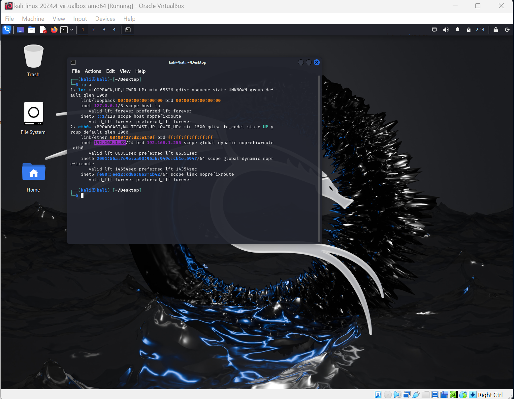
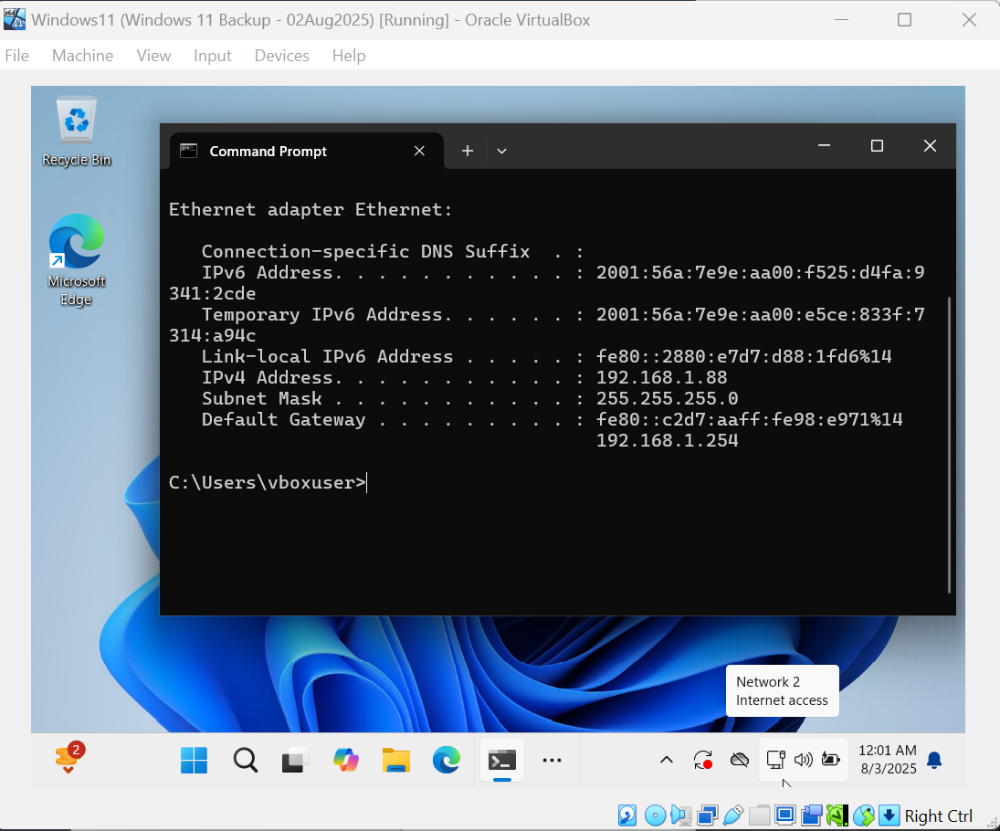
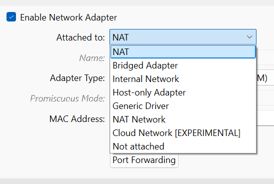

# 🧪 Home Lab Setup with Oracle VirtualBox

Over the past few weeks, I set up a small home lab using Oracle VirtualBox to better understand virtual machines, networking, and safe testing environments. This write-up captures what I learned, including practical takeaways and personal reflections. I’ve also included screenshots of my setup and configuration steps.

---

## 1. Installing VirtualBox and Operating Systems

To get started, I installed [Oracle VM VirtualBox](https://www.virtualbox.org/), a free and open-source virtualization tool. It lets you create virtual computers (called virtual machines or VMs) that run inside your real machine. This is especially helpful for learning, testing tools, or running multiple OS environments without messing up your actual system.

I downloaded ISO files for the operating systems I wanted to experiment with:

- **Kali Linux ISO** from [kali.org](https://www.kali.org/get-kali/)
- **Windows 11 ISO** from the [Microsoft official site](https://www.microsoft.com/software-download/windows11)

An ISO file is basically a digital version of a physical installation disc. In VirtualBox, you mount the ISO to the VM's optical drive, then boot the VM to install the operating system.

**Screenshots:**
- Kali Linux running in VirtualBox  
  

- Windows 11 running in VirtualBox  
  

---

## 2. Understanding Virtual Machine Networking

After setting up the VMs, the next step was learning how to connect them to networks. VirtualBox offers several networking modes, each with different use cases. I experimented with the most common ones to see how they worked.

### Bridged Adapter Mode

In this mode, the VM connects to your physical network like any other device on your home router. It receives an IP address from your router's DHCP server and can communicate with other devices on your LAN, including your host computer, phones, or printers.

**Key takeaways:**
- VM acts like a physical machine on the network
- Great for testing real-world network access
- **Risk**: If you're testing malware or unknown software, this is dangerous because anything running inside the VM can affect other machines on your network

I initially used Bridged Mode so my VMs could access the internet and communicate with other devices. But after some research, I realized that this is **not a safe choice for testing potentially harmful software**.

### Internal Network Mode

Internal Network mode creates a completely isolated network. Only other VMs connected to the same internal network can communicate with each other. The VM has no access to the internet or your local network. This is the **safest option** for malware analysis or simulating attacks in a controlled environment.

**Key takeaways:**
- VMs are isolated from your host and LAN
- Safer for malware testing or practice labs
- You need to assign IP addresses manually since there's no router

**Screenshot: Network Adapter Settings**  

---

## 3. Assigning Static IP Addresses

While testing with Internal Network mode, I realized there’s no DHCP server available by default. This means the VMs won’t get an IP address unless I assign one manually.

I learned how to configure static IP addresses within the operating systems. This is a useful skill, especially in lab environments or networks where you want predictable addressing.

**Private IP address ranges I used:**
- `192.168.x.x` for small, home networks
- `10.x.x.x` for larger, internal networks

These are considered private address spaces, meaning they won’t route to the internet and are ideal for internal use. It’s good practice to stick to these ranges for better organization and security.

---

## 4. Lessons and Reflections

Setting up this home lab helped me understand much more than just how to run a VM. Here are a few things I took away from the process:

- **Virtualization** is incredibly powerful for testing without risk to your real system
- **Networking modes** like Bridged and Internal make a huge difference in security and functionality
- **Static IP configuration** is necessary when building isolated networks and helped me better understand how IP addressing works

This was a hands-on way to explore operating systems, networking, and security principles. I’m planning to expand this lab to include more VMs, simulate attacks, and possibly build a small Active Directory environment in the future.

